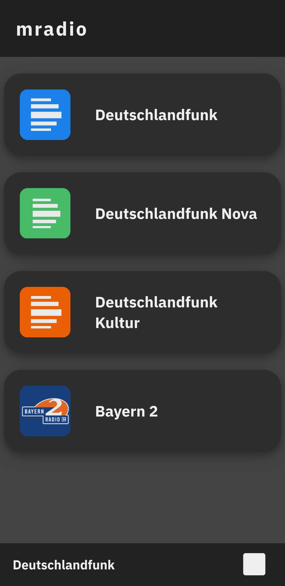

# what
a website (mobile first) to play radio channels

# why
i was discontent with the available apps because:

* app doesn't support _all_ channels
* ui is too complicated
* app is bloated
* ui isn't pretty enough
* etc

and i didn't want to get into appmaking for such a simple task

# how do i use this?
* put the channel name, stream url and logo into `streams.js`
* (_the ui is generated from `streams.js`_)
* tap a channel to start playing

# etc

license: gpl 3
